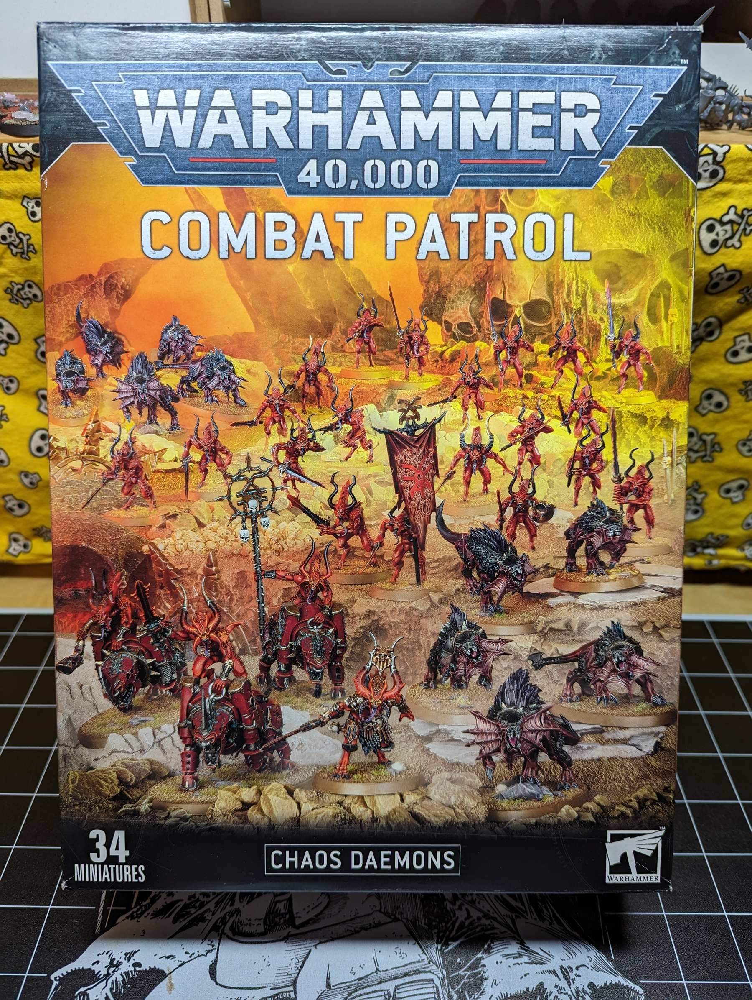
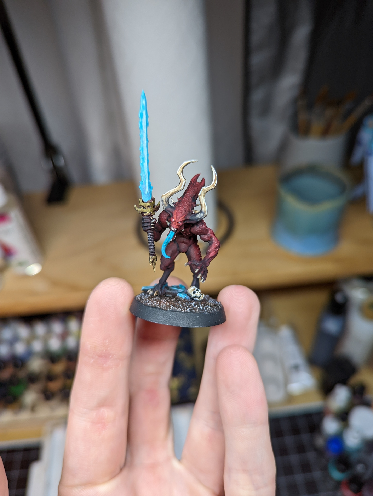
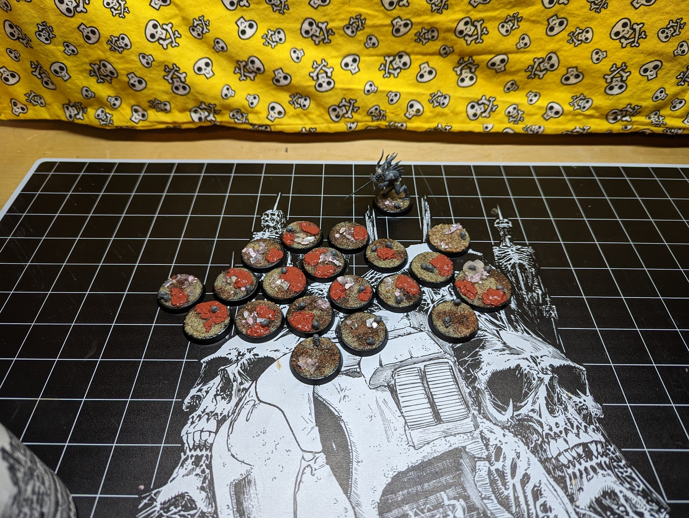
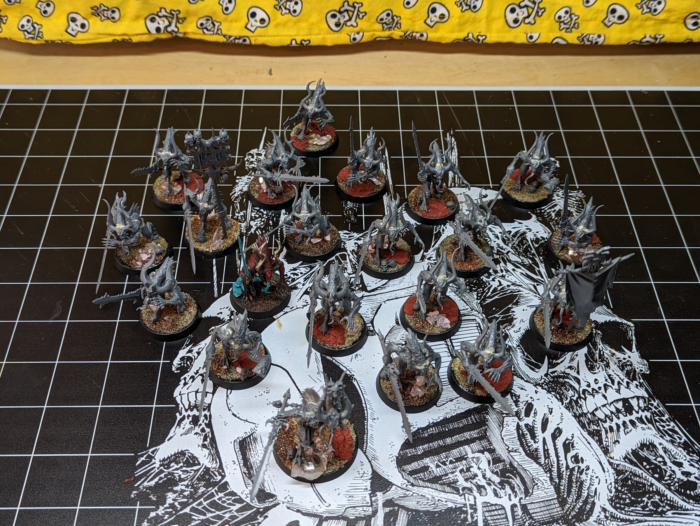

## Armies on Parade

Each year Games Workshop runs a year-long event which is composed of a series of goals. These goals are separated in time by months and revolve around picking a new faction and then progressively adding to it throughout the year. Each goal has a different theme, for example adding troops or adding a huge grotesque monster to your retinue. I figure this will be a good opportunity to keep some consistency to my hobbying and a fun thing to participate in as each local Games Workshop store has events surrounding each milestone.

## Choosing an Army

[The first goal](https://www.warhammer-community.com/2022/01/03/armies-on-parade-2022-begins-with-new-year-new-army/) spans the months of January and February and revolves around choosing an army. This is actually a rather large task as this milestone is responsible for not only picking a new army, but choosing a paint scheme for the army and applying that paint scheme to the contents of a Combat Patrol box. I spent a good chunk of the last year trying to figure out how to justify starting a Chaos Daemons army (specifically Khorne daemons). Fortunately for me a confluence of events started this process, I rounded out 2000 points of Blood Angels, Chaos Daemons codex released and alongside it a Khorne Daemon Combat Patrol box, and some absolutely stellar Greater Daemon models released. Well a short trip to my FLGS and an exchange of legal tender, and I'm now a Chaos Daemon collector (_soon_ to be player).

## Paint Scheme

I can't stress enough how important the paint scheme is. In my opinion this sets the tone for the rest of the project. Are you going to be excited to get to painting or feel like you're resuming a chore? When painting an army I'm trying to get it done at a standard between I'm not embarrassed to show it off but there's definitely room for improvement AND get it done quickly. To meet this standard I find that each step needs to have a relatively large impact in the final result, I'm not going to be futzing around with minutiae.

Actually deciding the paint scheme was the process of me trying to decide if I should do something _unique_ and personal, like Daemons from a realm experiencing some kind of Fimbulwinter or try my hand at molten Daemons glowing from the inside atop not very well disguised cork board. For a while I considered having my army set in some kind of blood marsh and trying some resin pours. I ended up opting for a classic Khorne red (daring I know) with a teal-ish complementary color and a cooler white for the bone.

Here's my test model! I think it has a nice bit of contrast in the skin, an interesting color gradient where the bone attaches to the skin, and a vibrant complimentary color in the teal/aquamarine blue.1

## Building

The Khorne Daemons when built have a pretty large gap between the top of the head and the elongated Alien head. I tried using Milliput to close it, but I thinned it a bit too much and I don't think achieved my intended effect. Otherwise, the box was easy to assemble and I opted to do sub assemblies with the Bloodcrushers separating the rider from its mount. The models themselves have excellent volumes and are very easy to access with a brush.

## Basing

Not too much to say here. I used [Vince Venturella\'s Chaos Waste Bases](https://www.youtube.com/watch?v=PD8_tQVq9-w&ab_channel=VinceVenturella) as inspiration because I was looking for something simple yet visually interesting.

## Current Progress

And here we are, 20 Bloodletters and 1 Bloodmaster built and based, ready for priming!

---

<footer style={{ fontSize: '80%' }}>
  1 Observant readers can probably see that this picture was chronologically taken before the desk completed therefore before the new year. Which puts some of this work in 2022, which leaves judgement as an exercise to the reader.
</footer>