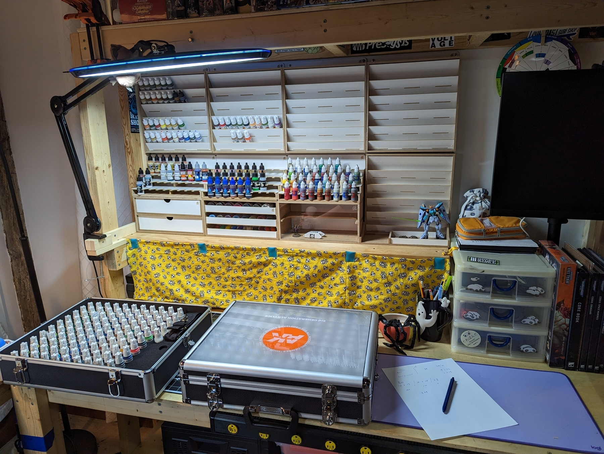

---
## Hello!

Welcome to the inaugural post on Mini Musings! You're probably one of, if we're being optimistic, dozens of humans who are reading this. The blog serves as a central place for me to collect my thoughts, show off a bit, and keep an ever expanding record of what goes on in my hobby sphere.

## The Hobby Space

I'd be lying if I said Warhammer has been an ever present force in my life, something which I was enamored with as a child. To be honest I knew of Warhammer 40k (less so of fantasy) in so far as it was a game played with miniatures where everything was measured with rulers, and there were a bunch of video games spawned off the IP. It wasn't until around February 2020 when a friend mentioned the game Kill Team, and if I was interested in playing. Well it's pretty obvious what happened next, I said yes and picked up my first box of Warhammer, 10 Kabalite Warriors.

### Everything Starts Somewhere

In the beginning I was simply using a cheap LED desk lamp and a coffee table in my living room to paint up some Kabalite Warriors. Look at these guys, a regular paint by numbers. I still have these children of Commorragh, and they regularly feature in my Drukhari army usually doing drive bys from a Raider.

 

### Desk Life

I moved on from the coffee table pretty quickly as shortly after painting my first Kill Team I moved in to my partner's condo. Here there was a worktable where they and I would paint side by side. You can make out the two lamps, each one over our respective tiny painting spaces. We watched a lot of Star Trek there, Next Gen of course. _Engage_

 

While the cramped desk is dear to my heart, a larger space was needed. I having experience only building IKEA furniture was in awe at my partner's ability to draw up, supply, cut, sand, and stain all the materials to extend the desk. 13 feet of additional workstation later and, we now had dedicated desk space where we could do all manner of hobbying. In the center of the photo there's an open box next to my palette. I guess at some point I was able to store all of my paints in just that, I think it consisted of a Vallejo starter set and an assortment of Games Workshop paints.

 

Well a year later, and we found ourselves moving, this time across states to the North East. The desk came with us, and it grew a few things: a dedicated air brushing station, paints, basing materials, and naturally lots of unpainted miniatures.

 

### Introducing Shelves

At this point we've been living at our new place for a little over a year. I think this is when I know I'm deep in the Hobby sarlacc pit, slowly digesting away with no chance of escape. For Christmas this year my partner surprised me with what I can only describe as my ultimate hobby workspace. Modular shelving and drawers for all my painting supplies with a magnetized cloth for hiding (read protection from our cat) any miscellaneous or larger WIP stuff. A dry-erase board was added to the right of the shelving and the monitor was mounted to an arm (talk about space efficiency).

 

Those empty shelves weren't empty for long, as my parents were gracious enough to gift me the complete set of AK Interactive 3rd generation acrylics. My words will only fall flat when compared to the _majesty_ of the final picture. Still a week later I go downstairs just to admire it, it's so cool!

 

### Next Steps

Well I guess it's time to put down this keyboard and pick up a paint brush!