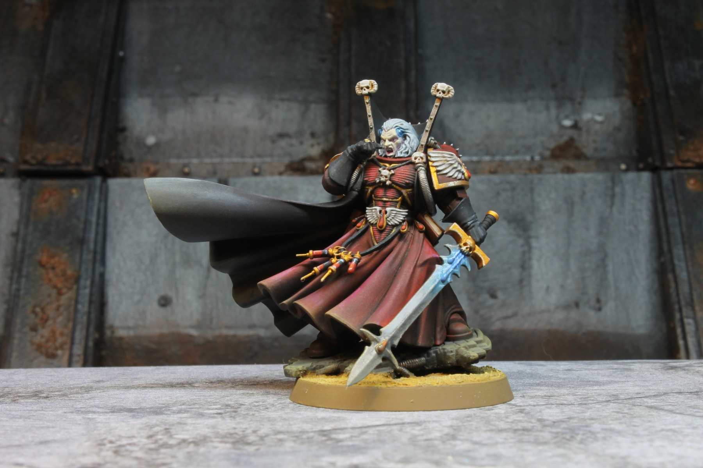

## Miniature Photography

Now that I've got some so-so painted miniatures I reckon it's time to share them with the world. What better way to do so than by wiping out the old DSLR and having a good old fashion photo shoot. Up until now photos on the blog have been taken using my Pixel 6 Pro, and while this phone has a decent enough camera with loads of software post processing it's not the best at capturing tiny objects. I have to click to focus on the subject and then hope it doesn't blur some part of the model which is slightly in the foreground, or have it focus on something other than the model. It's ruined quite a few photos by introducing dramatic blur which I don't notice until well after the event. Miniature photography is honestly pretty fun, I enjoy dialing in the camera settings and seeing the model in a way I can't really see with my own eyes. Fair warning, I'm no expert, but wanted to document my setup and process :D

## Gathering the Gear

Alright so I've laid out my problem, and to get really crisp and well lit photos I first need to gather some gear. Here's everything I'm using:

- Canon EOS Rebel T3 (a very entry level DSLR I purchased sometime around 2013)
- A tripod (or some stationary surface which you know the camera wont move, this is important because we really need to slow down the shutter speed)
- A slightly raised surface (because my tripod mounting point is fixed I need something to raise the model slightly so the view isn't obstructed by the shooting surface)
- Good lightning (using you existing painting lights should be fine)
- Neutral background and foreground (when all else fails some white printer paper is an okay option)
- Ruler (while not totally necessary, I like having one to make sure my subject is around the same distance from the lens between shoots)
- Your model! (or models!)

## Assembling the Scene

I grabbed a neutral play mat and drapped it over my wet pallet. This gives me a slightly heightend surface and less hassle when taking photos. I've also placed some terrain behind the model which sets the scene a bit, but also provides a nice neutral background. You can see I've got two lights, the large one is a wide spectrum LED light around 2,200 lumens and a rated CRI of ~80, so fairly color accurate. The other smaller light I have outputting a warm light to provide a bit of contrast and to act as an organic light source for the scene. The model is then placed 22cm from its base center to the camera lens.

## Dialing In the Settings

My camera has some really useful accompanying software, the Canon EOS Utility 2. When the camera is connected to a computer this software allows for the almost complete control of the camera. Additionally, I get a live viewing window which gives me a pretty accurate representation of what the final image will be. If I increase the ISO too high I immediately see the increased exposure illustrated by the washing out of the live image.

My camera setting starting point is based on the tutorial created by Games Workshop, [The Model Photograph](https://www.warhammer-community.com/2018/03/06/the-model-photo-how-to-photograph-models-for-display/). The Games Workshop tutorial is really useful and well worth the read.

| Image | Shutter Speed | F-Stop | ISO | Notes |
| :---: | :-----------: | :----: | :-: | :---: |
| 1 | 0" 3 | 22 | 100 | The overhead light is directly above the model |
| 2 | 0" 3 | 22 | 100 | Zoomed the camera out a bit more and refocused |
| 3 | 0" 3 | 22 | 100 | The overhead light has been moved lower and in front of the model |
| 4 | 0" 3 | _25_ | 100 | |
| 5 | 0" 3 | 22 | _200_ | |
| 6 | _0" 5_ | 22 | 100 | |

### Image 1

Because I have my main light source directly above the model, the model casts shadows on itself and darkens a lot of areas. While this can be an interesting effect, I'm trying to capture the entire model and needs to be adjusted. Additionally, the model is a bit out of focus and I address this in the next photo.

### Image 2

With the second image I've zoomed the camera out some and refocused. Because I'm using a DSLR and it has a large DTI the captured image is still very crisp and detailed. Unfortunately I still have the light directly over the model and there is still a pronounced shadow.

### Image 3

Finally I've moved the main light source and just look at that! While the model is not entirely uniformally lit, the shadows it does have read realisitcally and compliments my paint job.

### Image 4

Images 4 through 6 I've made small adjustments to various settings, but found them to be slightly over exposed or too dark.

### Image 5

### Image 6

## Wrapping Up

With a proper setup and some trial and error miniature photography can be a fun and rewarding exercise! Hopefully I left you learning something new, and at the very least I have a nice reference for the future. For now I leave you with a photo of the chief libriarian1 himself.

---

<footer style={{ fontSize: '80%' }}>
  1 The 'wiping away blood' pose really is impossible to get right and just looks like he's either smelling something or amazed at his own finger. Someday I'm going to add some blood effects which _may_ make the pose work.
</footer>